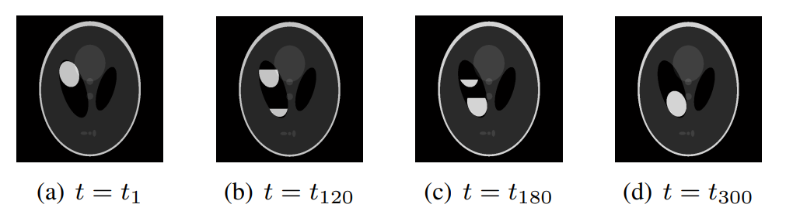
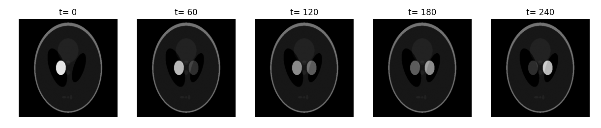
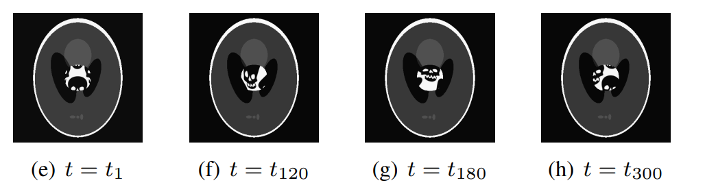
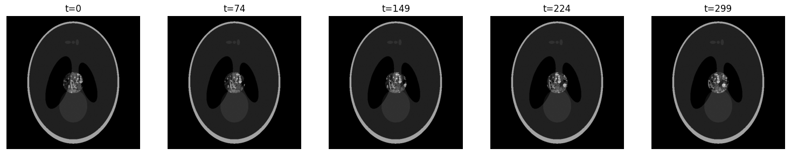
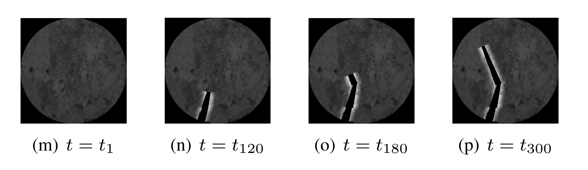
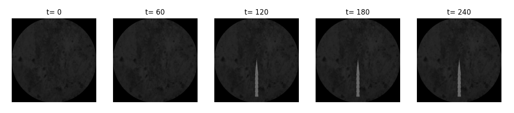

### CIMTO Implementation 1: Generating Phantoms

##### Marcell Nemeth (S4456394) 
#### Description
This project attempts to replicate Van Eyndhoven et al. 2014, a research paper on iteratively reconstructing structural changes in CT scans, by distinguihing between stationary and "dynamic" areas.

To be able to compare results, a series of different phantoms need to be generated, as close to the original paper as possible.

As the original paper, these generators also output pictures of size 500 by 500, and create a sequence of 300 frames.
For the visualizaiton the sequence is sampled at equal intervals.

#### Structure

The phantoms.py file contains functions to generate 4 different types of phantoms mentioned in the paper:
| No. | Description | Function | Status |
|---|---|---|---|
|1. | Shepp-Logan phantom with two chambers, fluid flows from one to another (linear/sigmoid transfer). The two chambers currently only change intensity, not the area the fluid covers. This will be implemented later.| create_phantom1()|Linear implemented (Sigmoid if needed)
|2.| Shepp-Logan phantom with one chamber, the underlying texture is shifted to simulate fluid movement. A predefined texture is shifted behind an ellipse mask (chamber), to simulate fluid movement. In the original paper it seems a swirl transformation was also applied. | create_phantom2()|Implemented, swirl can be added as optional|
|3.| Random Blob, with two connected chamber, fluid movment is simulated by texture shift/swirl. The mask for the "8-shaped" chamber and the background of the blob still needs to be implemented.| create_phantom3()|Not yet implemented, but just combination on 1) and 2)|
|4.| Circular background with (Gaussian?) organic texture and sudden crack (angled). The crack is formed by an initial elongated triangle, to which additional triangles are transposed to 5 frames per triangle (to simulate sudden crack). There is a bright hue around the crack in the original paper, and it seems to use elongated poligons instead. | create_phantom4()|Straight crack implemented (angle not yet)|

---
#### TODO
##### Phantoms Feedback
- [ ] Remove Paths/Replace texture
- [ ] Create readnom seed/ parameters 
- [ ] Documentation for parameter/seed 
##### Synogram
- [ ] Scanning protocol for projection angle sequence
- [ ] Strip kernel projector
- [ ] Poisson noise

##### Code reconstruction
- [ ] Implement SIRT (from ASTRA)
- [ ] SIRT per angular subset
- [ ] Implmenet rSIRT
- [ ] Create Table 1
- [ ] Convergence Plot
#### Results

**NOTE**: The following issues are known and will be fixed:
- [ ] Phantom 1 Chambers are gradually filled by changing intensity, a mask needs to be applied instead
- [ ] Phantom 3 connected chambers need to be created
- [ ] Phantom 4, angle in crack needs to be created, with brigther edges
- [ ] Phantom 4, background is used from original paper, higher res. background needed for 500x500

---

##### Phantom 1 Original

##### Reconstructed

##### Phantom 2 Original

##### Reconstructed

##### Phantom 4 Original

##### Reconstructed

---

#### Original Paper
Van Eyndhoven, G., Batenburg, K. J., & Sijbers, J. (2014). Region-based iterative reconstruction of structurally changing objects in CT. IEEE Transactions on Image Processing, 23(2), 909–919. https://doi.org/10.1109/TIP.2013.2297024

---

#### Resources:

https://astra-toolbox.com/docs/algs/SIRT.html
##### Scikit
https://sigpy.readthedocs.io/en/latest/generated/sigpy.shepp_logan.html
https://github.com/mckib2/phantominator/blob/main/phantominator/ct_shepp_logan.py
https://scikit-image.org/docs/stable/auto_examples/transform/plot_transform_types.html#sphx-glr-auto-examples-transform-plot-transform-types-py
https://scikit-image.org/docs/stable/auto_examples/transform/plot_geometric.html

##### Textures Used

https://www.vecteezy.com/vector-art/3794343-the-pattern-of-the-skull-pattern-with-white-skull

